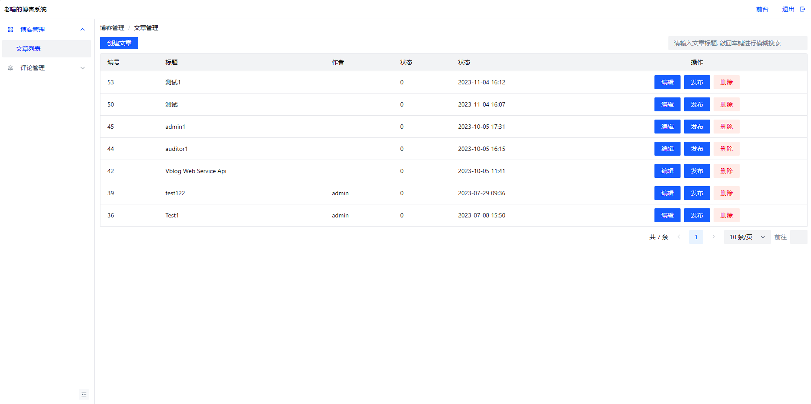
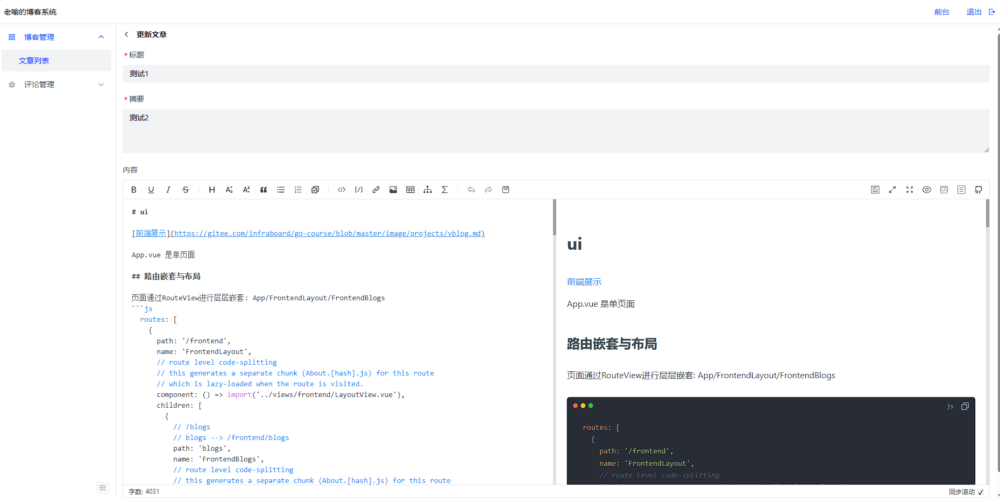
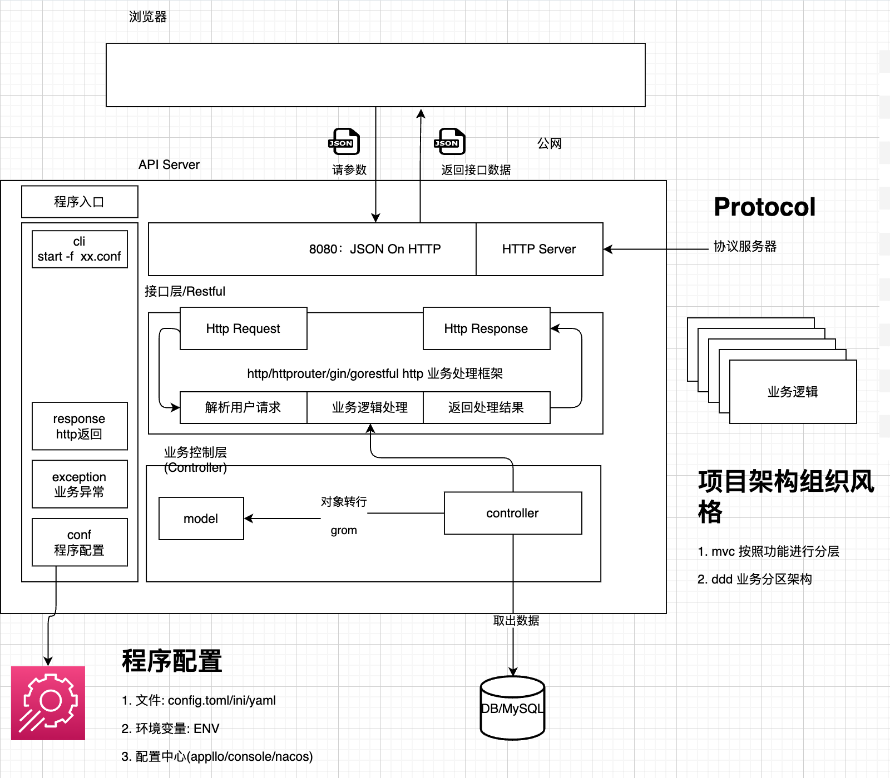
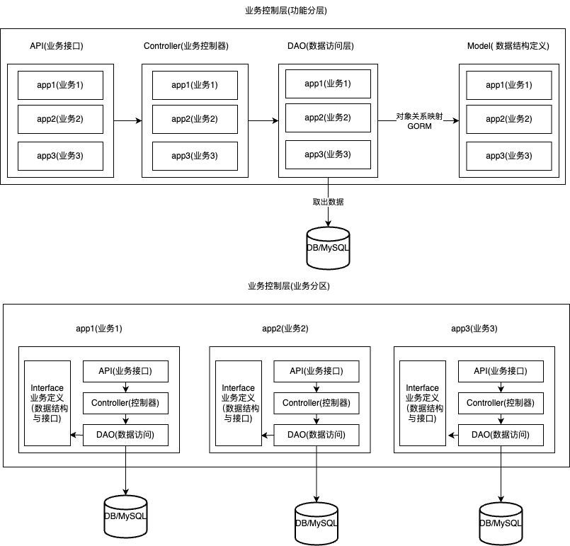
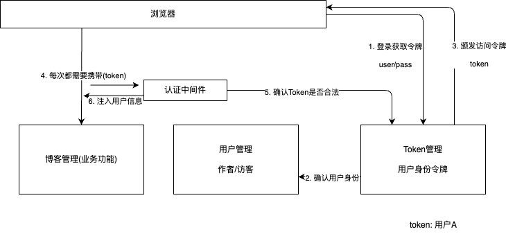
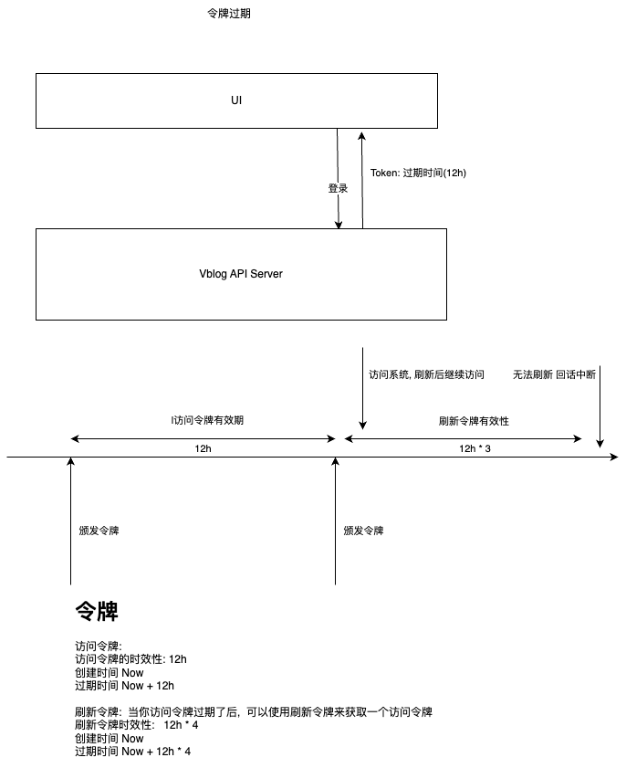
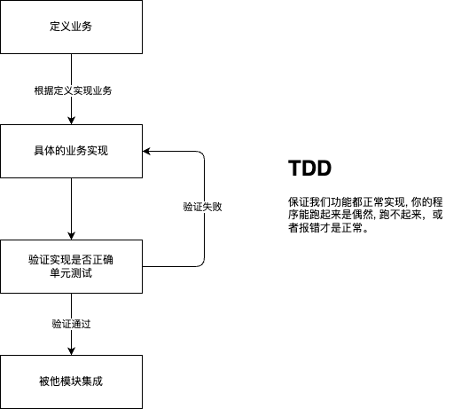

# Web全栈开发(Vblog)

## 需求

博客编写与发布

目标用户:
+ 文章管理员(作者): 写博客的后台
+ 访客: 浏览文章的前台

## 原型

### 博客后台(作者)

1. 列表页



2. 编辑页




### 博客前台(访客)

博客浏览页


## 架构设计

### 整体架构




### 业务架构



## 项目设计

### 概要设计(流程)

1. 业务交互流程



+ 博客管理(Blog)
+ 用户管理(User)
+ 令牌管理(Token)

2. 登录过期



### 数据库设计

1. 博客管理
```sql
CREATE TABLE `blogs` (
  `id` int unsigned NOT NULL AUTO_INCREMENT COMMENT '文章的Id',
  `tags` text CHARACTER SET utf8mb4 COLLATE utf8mb4_general_ci NOT NULL COMMENT '标签',
  `created_at` int NOT NULL COMMENT '创建时间',
  `published_at` int NOT NULL COMMENT '发布时间',
  `updated_at` int NOT NULL COMMENT '更新时间',
  `title` varchar(255) CHARACTER SET utf8mb4 COLLATE utf8mb4_general_ci NOT NULL COMMENT '文章标题',
  `author` varchar(255) CHARACTER SET utf8mb4 COLLATE utf8mb4_general_ci NOT NULL COMMENT '作者',
  `content` text CHARACTER SET utf8mb4 COLLATE utf8mb4_general_ci NOT NULL COMMENT '文章内容',
  `status` tinyint NOT NULL COMMENT '文章状态',
  `summary` varchar(255) CHARACTER SET utf8mb4 COLLATE utf8mb4_general_ci NOT NULL COMMENT '文章概要信息',
  `create_by` varchar(255) COLLATE utf8mb4_general_ci NOT NULL COMMENT '创建人',
  `audit_at` int NOT NULL COMMENT '审核时间',
  `is_audit_pass` tinyint NOT NULL COMMENT '是否审核通过',
  PRIMARY KEY (`id`),
  UNIQUE KEY `idx_title` (`title`) COMMENT 'titile添加唯一键约束'
) ENGINE=InnoDB AUTO_INCREMENT=47 DEFAULT CHARSET=utf8mb4 COLLATE=utf8mb4_general_ci;
```

2. 用户管理

```sql
CREATE TABLE `users` (
  `id` int unsigned NOT NULL AUTO_INCREMENT,
  `created_at` int NOT NULL COMMENT '创建时间',
  `updated_at` int NOT NULL COMMENT '更新时间',
  `username` varchar(255) CHARACTER SET utf8mb4 COLLATE utf8mb4_general_ci NOT NULL COMMENT '用户名, 用户名不允许重复的',
  `password` varchar(255) COLLATE utf8mb4_general_ci NOT NULL COMMENT '不能保持用户的明文密码',
  `label` varchar(255) COLLATE utf8mb4_general_ci NOT NULL COMMENT '用户标签',
  `role` tinyint NOT NULL COMMENT '用户的角色',
  PRIMARY KEY (`id`) USING BTREE,
  UNIQUE KEY `idx_user` (`username`)
) ENGINE=InnoDB AUTO_INCREMENT=5 DEFAULT CHARSET=utf8mb4 COLLATE=utf8mb4_general_ci;
```

3. 令牌管理

```sql
CREATE TABLE `tokens` (
  `created_at` int NOT NULL COMMENT '创建时间',
  `updated_at` int NOT NULL COMMENT '更新时间',
  `user_id` int NOT NULL COMMENT '用户的Id',
  `username` varchar(255) CHARACTER SET utf8mb4 COLLATE utf8mb4_general_ci NOT NULL COMMENT '用户名, 用户名不允许重复的',
  `access_token` varchar(255) CHARACTER SET utf8mb4 COLLATE utf8mb4_general_ci NOT NULL COMMENT '用户的访问令牌',
  `access_token_expired_at` int NOT NULL COMMENT '令牌过期时间',
  `refresh_token` varchar(255) COLLATE utf8mb4_general_ci NOT NULL COMMENT '刷新令牌',
  `refresh_token_expired_at` int NOT NULL COMMENT '刷新令牌过期时间',
  PRIMARY KEY (`access_token`) USING BTREE,
  UNIQUE KEY `idx_token` (`access_token`) USING BTREE
) ENGINE=InnoDB DEFAULT CHARSET=utf8mb4 COLLATE=utf8mb4_general_ci;
```

注意:
```
现在流行尽量避免使用外建, 由程序更加业务逻辑 自行决定整个关联关系怎么处理
```

### Restful API设计

1. Restful: (Resource) Representational State Transfer(资源状态转换) API 风格
+ Resource Representational: 资源定义(服务端对象或者数据库内的一行纪录)
+ State Transfer:   创建/修改/删除

这张风格如何表现在API?
```
1. 资源定义
1.1 一类资源
/vblogs/api/v1/blogs: blogs 就是资源的类型: blogs 博客
/vblogs/api/v1/users: users 就是资源的类型: users 用户
1.2 一个资源
/vblogs/api/v1/users/1: 1 就是资源的id, id为1的资源

2. 状态转换: 通过HTTP Method来定义只有的状态转化, 理解为用户的针对某类或者某个资源的动作
POST: 创建一个类型的资源, POST /vblogs/api/v1/users 创建一个用户, 具体的参数存放在body
PATCH: 部分修改(补丁), PATCH /vblogs/api/v1/users/1, 对id为1的用户 做属性的部分修改, name:abc ("usera" ---> "abc")
PUT: 全量修改(覆盖), PUT /vblogs/api/v1/users/1, 对id为1的用户 做属性的全量修改, name:abc  除去name之外的所有属性全部清空
DELETE: 资源删除
GET: 获取一类资源: GET /vblogs/api/v1/users, 获取一个资源 GET /vblogs/api/v1/users/1
```

其他风格的API
```
POST url命名动作来表示资源的操作:  POST /vblogs/api/v1/users/(list/get/delete/update/...)
POST /pods/poda/logs/watch
```

#### 博客管理(设计完整的RESTful API)

1. 创建博客: POST /vblogs/api/v1/blogs
```json
{
 "title": "",
 "author": "", 
 "content": "",
 "summary": ""
}
```

2. 修改博客(部分): PATCH /vblogs/api/v1/blogs/:id
```json
{
 "title": "",
 "author": "", 
 "content": "",
 "summary": ""
}
```

3. 修改博客(全量): PUT /vblogs/api/v1/blogs/:id
```json
{
 "title": "",
 "author": "", 
 "content": "",
 "summary": ""
}
```

4. 删除博客: DELETE /vblogs/api/v1/blogs/:id
```json
body不传数据
```

5. GET /vblogs/api/v1/blogs/:id
```json
body不传数据
```

####  令牌管理(设计基础必须)

1. POST /vblogs/api/v1/tokens
```json
{
  "username": "",
  "password": "",
  "remember": true,
}
```

2. DELETE /vblogs/api/v1/tokens 
```json
body不传数据
```

#### 用户管理
```
功能完整, 不做API, 可以直接操作数据库, 也可以通过单元测试
```

## 项目开发

### 编写流程

+ 整体框架(上-->下)
+ 业务代码(下-->上)

1. 顶层设计: 从上往下进行设计
2. 业务代码: 从下往上写, 核心应该业务的实现

### 项目结构 

```sh
go mod init "gitlab.com/go-course-project/go13/vblog"
```

+ main.go: 入口文件
+ conf: 程序的配置处理
+ exception: 业务自定义异常
+ response: 请求返会的统一数据格式: {"code": 0, "msg": ""}
+ protocol: 协议服务器
+ apps: 业务模块开发区域


### 业务模块开发

业务模块开发遵循如下规则:
定义业务(Interface): 梳理需求, 抽象业务逻辑, 定义出业务的数据结构与接口约束
业务实现(Controller): 根据业务定义, 选择具体的技术(比如MySQL/MongoDB/ES)，做具体的业务实现
业务接口(API): 如果需要对外提供 API, 则按需将需要的对外暴露API接口

表现在目录结构上:
定义业务: 业务模块顶层目录, 具体表现为: user/interface.go(接口定义)
业务实现: 业务模块内impl目录, 具体表现为: user/impl/impl.go(业务实现对象)
业务接口: 业务模块内api目录, 具体表现为: user/api/api.go(HTTP Restful接口实现对象)

API和Interface的区别
+ API: 应用编程接口, HTTP 接口，通过网络 可以调用的
+ Interface: 对某个对象(Struct)的约束

### 用户管理模块开发

1. 定义业务
```go
// 面向对象
// user.Service, 设计你这个模块提供的接口
// 接口定义, 一定要考虑兼容性, 接口的参数不能变
type Service interface {
	// 用户创建
	// CreateUser(username, password, role string, lable map[string]string)
	// 设计CreateUserRequest, 可以扩展对象, 而不影响接口的定义
	// 1. 这个接口支持取消吗? 要支持取消应该怎么办?
	// 2. 这个接口支持Trace, TraceId怎么传递？
	// 中间件参数，取消/Trace/... 怎么产生怎么传递
	CreateUser(context.Context, *CreateUserRequest) (*User, error)
	// 查询用户列表, 对象列表 [{}]
	QueryUser(context.Context, *QueryUserRequest) (*UserSet, error)
	// 查询用户详情, 通过Id查询,
	DescribeUser(context.Context, *DescribeUserRequest) (*User, error)

	// 作业:
	// 用户修改
	// 用户删除
}
```

2. 业务实现

业务定义层(对业务的抽象), 由impl模块来完成具体的功能实现
```go
// 实现 user.Service
// 怎么判断这个服务有没有实现这个接口喃？
// &UserServiceImpl{} 是会分配内存, 怎么才能不分配内存
// nil 如何生命 *UserServiceImpl 的 nil
// (*UserServiceImpl)(nil) ---> int8 1  int32(1)  (int32)(1)
// nil 就是一个*UserServiceImpl的空指针
var _ user.Service = (*UserServiceImpl)(nil)

// 用户创建
func (i *UserServiceImpl) CreateUser(
	ctx context.Context,
	in *user.CreateUserRequest) (
	*user.User, error) {
	return nil, nil
}

// 查询用户列表, 对象列表 [{}]
func (i *UserServiceImpl) QueryUser(
	ctx context.Context,
	in *user.QueryUserRequest) (
	*user.UserSet, error) {
	return nil, nil
}

// 查询用户详情, 通过Id查询,
func (i *UserServiceImpl) DescribeUser(
	ctx context.Context,
	in *user.DescribeUserRequest) (
	*user.User, error) {
	return nil, nil
}
```

TDD的思想: 保证代码的质量



3. 怎么验证当前这个业务实现是不是正确的? 写单元测试(TDD)


